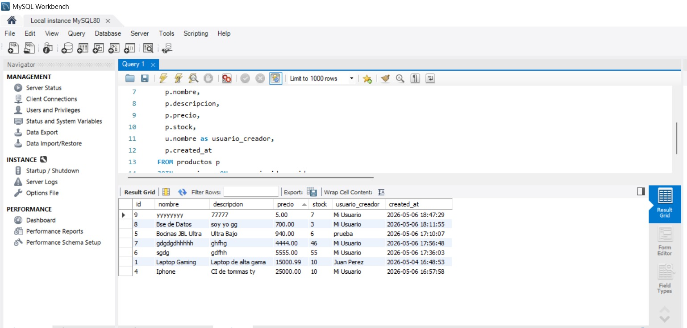
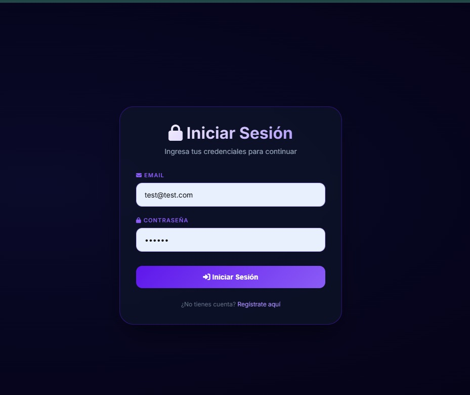
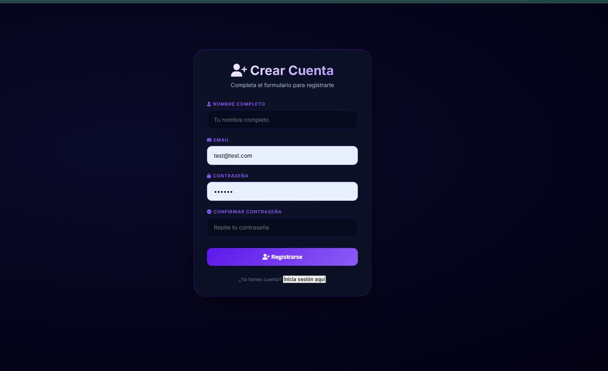
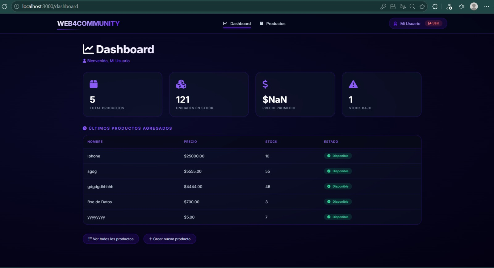
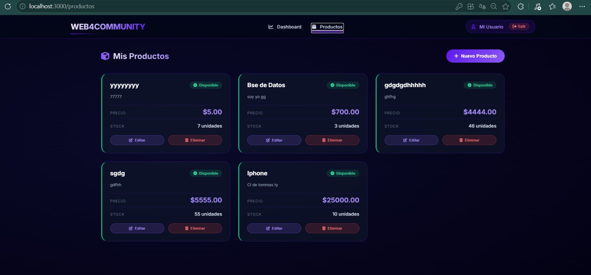
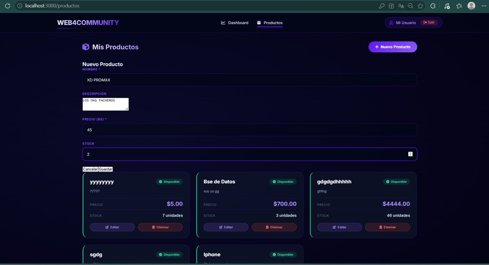
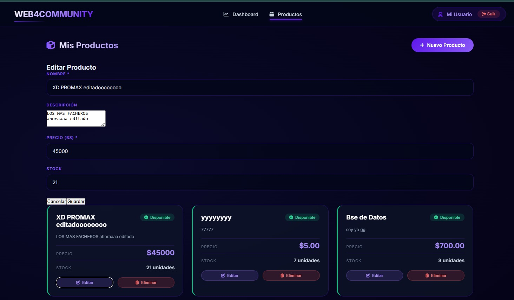
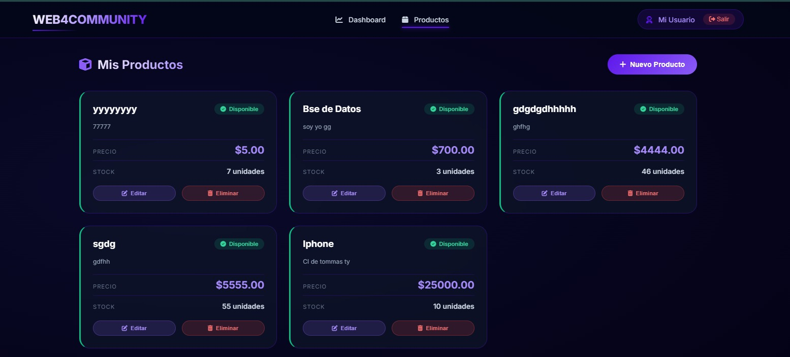

# Web4Community - Proyecto Full Stack

Aplicación web para gestión de productos con autenticación de usuarios.

## 📋 Tecnologías utilizadas

| Tecnología | Uso |
|------------|-----|
| **Node.js + Express** | Backend API REST |
| **MySQL** | Base de datos |
| **React** | Frontend SPA |
| **JWT** | Autenticación |
| **Axios** | Peticiones HTTP |
| **bcryptjs** | Encriptación de contraseñas |

## 🚀 Funcionalidades

- ✅ Registro de usuarios
- ✅ Inicio de sesión (Login)
- ✅ CRUD completo de productos
- ✅ Dashboard con estadísticas
- ✅ Rutas protegidas con JWT
- ✅ Cierre de sesión

## 📸 Capturas de pantalla










## 🔧 Instalación

### Backend
```
cd web4community-backend
npm install
npm run dev
```

### Frontend
```
cd web4community-frontend
npm install
npm start
```

## 👨‍💻 Autor

Leonardo Domingo Tapia - tleo46087@gmail.com