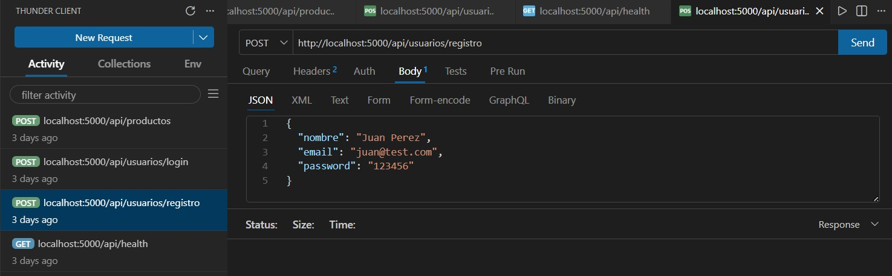
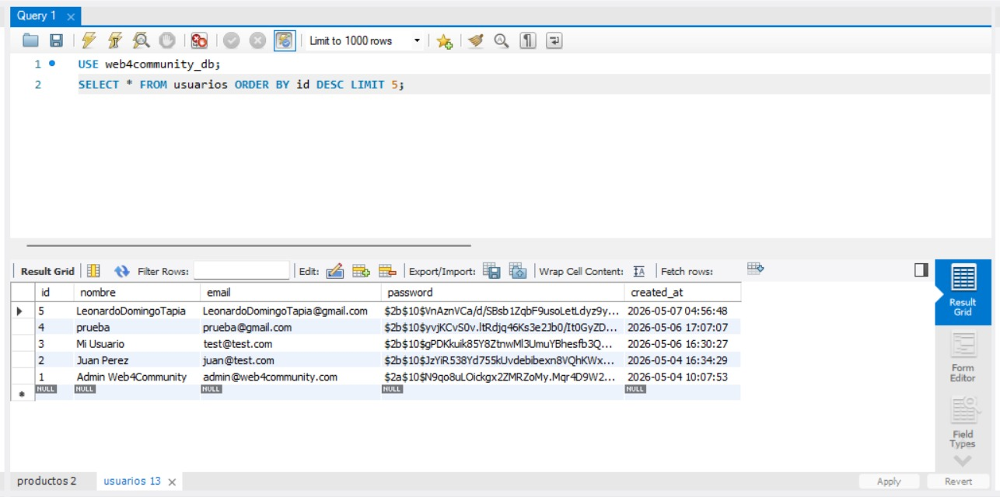
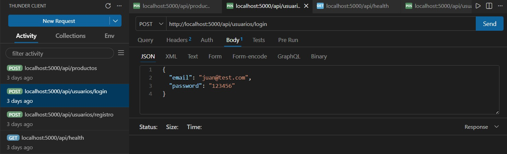
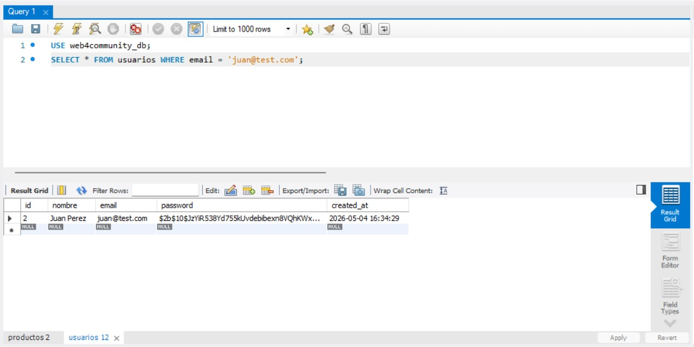
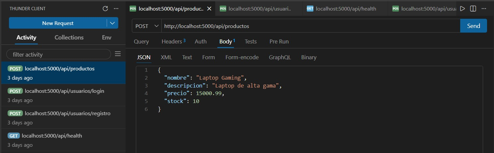
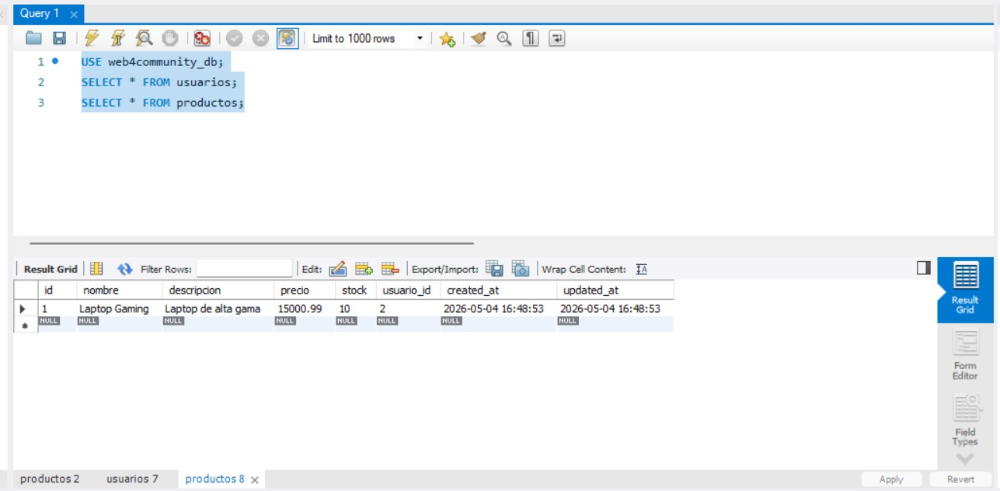

# Web4Community - Backend API

API REST para gestión de productos con autenticación de usuarios usando JWT.

## 📋 Tecnologías utilizadas

| Tecnología | Uso |
|------------|-----|
| **Node.js + Express** | Servidor backend |
| **MySQL** | Base de datos |
| **JWT** | Autenticación (tokens) |
| **bcryptjs** | Encriptación de contraseñas |
| **dotenv** | Variables de entorno |
| **cors** | Comunicación con frontend |

## 🚀 Funcionalidades

- ✅ Registro de nuevos usuarios
- ✅ Inicio de sesión (Login) con JWT
- ✅ CRUD completo de productos
- ✅ Rutas protegidas (requieren token)

## 📸 Pruebas realizadas

### Registro de Usuario



### Inicio de Sesión (Login)



### CRUD de Productos



## 🔧 Instalación

```bash
git clone https://github.com/leonardodomingotapia/web4community-backend.git
cd web4community-backend
npm install
npm run dev

Endpoints
Método	Endpoint	Descripción
POST	/api/usuarios/registro	Registrar usuario
POST	/api/usuarios/login	Iniciar sesión
GET	/api/productos	Listar productos
POST	/api/productos	Crear producto
PUT	/api/productos/:id	Actualizar producto
DELETE	/api/productos/:id	Eliminar producto


Autor
Leonardo Domingo Tapia - tleo46087@gmail.com